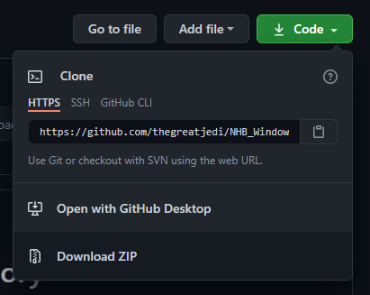

# Windows to History

## Table of Contents
* [Introduction](#introduction)
* [Requirements](#requirements)
* [Installation](#installation)
* [Usage](#usage)

## Introduction
Windows to History is a Capstone Project sponsored by the Singapore National 
Heritage Board. It is completed by Koh Sook Bin and Yeo Whye Chung Nelson as 
part of the course requirements for the Master of Technology in Intelligent
Systems programme by the Institute of Systems Science of the National
University of Singapore.

In this project, a web application is developed to demonstrate the use of
machine learning techniques to implement image captioning via an
attention-based model and image tagging via object detection. 

This application is built using the following frameworks:
* [FastAPI](https://fastapi.tiangolo.com)
* [React](https://reactjs.org)

## Getting Started
### Prerequisites
This application has been tested to run in a Windows 10 environment.
1. Download and install the latest version of 
   [Python 3.8](https://www.python.org/downloads).
2. After installing Python, open the Command Prompt (in Administrator Mode if
   necessary) and install pipenv.
   
       pip install pipenv

### Installation
1. Clone this repository to your local file directory. You can do this using 1 
   of 2 methods:
   1. Download directly from [Github](https://github.com/thegreatjedi/NHB_Windows_to_History)
   in a web browser.

      
   2. If you have Git installed, you can clone the repository via the Command
   Prompt.
      
          git clone https://github.com/thegreatjedi/NHB_Windows_to_History.git
   3. Once downloaded, navigate to the folder location of the downloaded
   repository in the Command Prompt. For example,
      
          cd C:\Programming_Projects\Windows_to_History
   4. Once you are in the correct folder location, enter the following commands
      to install the necessary Python packages in an isolated virtual
      environment:
      
          pipenv shell
          pipenv install --ignore-pipfile
      This will install the following key packages and their dependencies:
      * aiofiles
      * fastapi
      * jinja2
      * python-multipart
      * uvicorn
   
## Usage
1. In the Command Prompt, navigate to the project directory. For example,
      
       cd C:\Programming_Projects\Windows_to_History
2. Enter the following commands to activate the pipenv virtual environment and
start the server:
   
       pipenv shell
       uvicorn main:app
3. Once the backend server has finished launching, the frontend webpage can be
accessed via web browser at [http://localhost:8000/](http://localhost:8000/)
4. Alternatively, you can configure a specific IP address and network port to
   use. This is required if you wish to access the application remotely from a
   different computer. For example, the following command will allow you to
   access the webpage at [http://192.168.119.1:1229/](http://192.168.119.1:1229/)
   
       uvicorn main:app --host 192.168.119.1 --port 1229
5. To shutdown the server, press Ctrl+C in the Command Prompt to end program
   execution.
   
## Contact Us
* Koh Sook Bing - [sookbing13@yahoo.com](mailto:sookbing13@yahoo.com?subject=NHB%20Capstone%20Project)
* Yeo Whye Chung Nelson - [nelsonyeowc@hotmail.com](mailto:nelsonyeowc@hotmail.com?subject=NHB%20Capstone%20Project)

## References
* [Show, Attend and Tell: Neural Image Caption Generation with Visual Attention](https://arxiv.org/pdf/1502.03044.pdf)
* [EfficientDet: Scalable and Efficient Object Detection](https://arxiv.org/pdf/1911.09070.pdf)
* [Flickr Image Captioning : TPU, TF2 & Glove](https://www.kaggle.com/ratthachat/flickr-image-captioning-tpu-tf2-glove)
* [TensorFlow Object Detection API](https://github.com/tensorflow/models/tree/master/research/object_detection)
